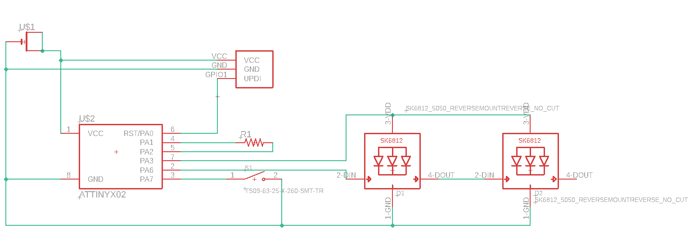

# BSides Newcastle (2024) Plant badge (Little Shop of Horrors)

**This badge was given out at BSIDES Newcastle and it's a working soil sensor!**

This badge uses UV full colour silk, and we ordered them from JLCPCB using EasyEDA. The PCB was built first with AutoCAD EAGLE, then exported.

Lots of things in this repo:

- eagle-files: all the stuff you need to tinker and modify the PCB in AutoCAD Eagle
- bsides-newcastle-2024.epro - The EasyEDA export, including the front and back art 
- gerber.zip: the file you can upload to JLCPCB and order your own badge, as is
- bsides-newcastle-2024-badge.ino: the arduino code that powers the badge, which you can modify and flash via the SAO connector

## Bill Of Materials

You can see a parts list on DigiKey [here](https://www.digikey.co.uk/en/mylists/list/1SMRGQW6IU).

Essentially its:

* ATTINY402 microcontroller
* Button - any surface mount button fitting the footprint will work
* CR2032 battery clip  - surface mount not through hole
* Neopixel 5050 addressable LED - Definitely get the right version of these
* Resistor - 6.8K 1206 resistor 

## How does it work?

The bottom of the badge (the pot) has 2 big copper pads under the artwork. Together, these act like a very tiny battery. 

This "battery" charges a little bit slower when surrounded by wet soil.

We start to charge the battery with one pin from the attiny402, and measure how charged it is with another.

This would be pretty much instant, so we slow down the charging with a resistor.

Watch my talk on the madness of developing this badge: https://www.youtube.com/watch?v=vW9SHSsYLkk

## Eagle designs and ordering your own badge

We've uploaded the AutoCAD EAGLE schematic and board design!  You will probably have to do some tweaks to get it working as they're not designed to be standalone exports.

This is then exported to EasyEDA to add the colour print to the boards. The file for that is already in the repo, so you can skip the EAGLE step if you prefer.

We've also uploaded the gerber.zip.  Take this to JLCPCB and you can order your own exact copies of the board :)

## Writing and flashing code!

We use [MegaTinyCore](https://github.com/SpenceKonde/megaTinyCore) for the arduino interface for ATTINY4x2 chips.

Dev and flashing is done within the Arduino IDE ( < v2 ) using a jtag2updi interface, as discussed [here](https://github.com/SpenceKonde/AVR-Guidance/blob/master/UPDI/jtag2updi.md)

We use [these little usb sticks](https://amzn.eu/d/c0lx0wG), with a 4.7k resistor soldered between the Tx and Rx lines.  

### Installing MegaTinyCore dependencies

This board package can be installed via the board manager in arduino. The boards manager URL is:

`http://drazzy.com/package_drazzy.com_index.json`

1. File -> Preferences, enter the above URL in "Additional Boards Manager URLs"
2. Tools -> Boards -> Boards Manager...
3. Wait while the list loads (takes longer than one would expect, and refreshes several times).
4. Select "megaTinyCore by Spence Konde" and click "Install". For best results, choose the most recent version.

### Setting up the IDE

1. Open the file **bsides-newcastle-2024-badge.ino** in arduino
2. Select tools > Board > megaTinyCore > ATtiny412/402/212/202
3. Select tools > Chip > ATtiny402
4. Select tools > Clock > 8Mhz internal *(we get power issues otherwise)*
5. Select tools > Programmer > SerialUPDI SLOW
6. Select tools > Port > ( pick your COM port)

### Flashing firmware
1. Connect the 3v3 pin to 3v on your usb (maybe wedge it in the battery clip)
2. Connect GND to GND
3. Connect UPDI to the RxD port
4. Click Upload button

## How to solder?

Make sure to line up the dot on the attiny402 with the dot on the board.

Make sure to line the corner of the LED with the cutout with the triangle on the board

*It's much easier if you hold the component in place with one hand, and then solder one pad. Now you can solder the rest of the pads with one hand*

